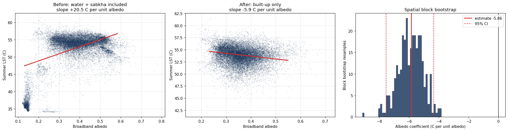

# Cool Roof Priority Index — Mussafah, Abu Dhabi

**Arab Youth Space Hackathon 2026 · 813 Challenge**
**Theme:** Urban Expansion, Land Use Change & Heat Risk  ·  **Track:** Hyperspectral Data Track
**Team:** T0050 · United Arab Emirates

> Satellite screening that turns a city heat map into a ranked, costed worklist of
> individual rooftops — and measures, from the city's own data, how much cooling
> each retrofit would actually buy.


---

## 2 · The business use case

**Who the user is.** The asset-management and urban-planning departments of a Gulf
municipality — in our case Abu Dhabi City Municipality — together with the
facilities teams of large industrial landlords.

**The decision they make.** Each budget cycle they allocate a finite heat-mitigation
and building-retrofit budget across thousands of candidate buildings. Cool-roof
coating is one of the cheapest interventions available, but it has to be targeted:
coating every roof in an industrial district is not affordable, and coating the
wrong ones wastes the budget.

**What they use today.** City-scale urban heat island maps produced by consultants
or research groups, plus manual site survey. Those maps show *where it is hot*. They
do not say *which roof to treat first*, nor *how much cooling the treatment buys*.
The link from map to works programme is made by judgement, not evidence.

**What this delivers.** A ranked list of individual rooftops with, for each one:
current albedo, current summer surface temperature, roof area, the estimated
temperature reduction a cool-roof retrofit would achieve, and the total cooling
benefit in °C·m². Delivered as a CSV and a GeoJSON that drops directly into an
existing GIS.

---

## 3 · The problem

Gulf cities are among the fastest-warming urban environments on Earth, and the
warming is not only climatic — it is constructed. When bare desert is replaced by
asphalt, concrete and dark roofing, surface albedo collapses, shortwave absorption
rises, evapotranspirative cooling disappears, and the stored heat is re-radiated
through the night.

In Mussafah, Abu Dhabi's principal industrial district, this process is visible and
ongoing: **[FILL: X] km² of bare desert became built-up between 2014–2016 and
2024–2026**, and that converted land warmed **[FILL: Y] °C more** than desert left
untouched over the same period.

**Why satellite data is the right instrument.** Rooftop albedo and surface
temperature cannot be inventoried at city scale by any ground method at acceptable
cost — there are tens of thousands of roofs, most behind private fences. Satellite
Earth observation measures both properties for every roof simultaneously, repeatedly,
and without site access. Nothing else can produce this inventory.

---

## 4 · Data used

| Product | Provider | Level | Dates used | Resolution | Licence |
|---|---|---|---|---|---|
| Landsat 8/9 Collection 2 Level-2 Surface Temperature (`lwir11`) | USGS / NASA | L2SP | 2014-05→2016-09 and 2024-05→2026-09, cloud < 15% | 30 m | Public domain |
| Sentinel-2 L2A (B02,B03,B04,B08,B11,B12,SCL) | ESA Copernicus | L2A | same windows | 10–20 m | Free and open |
| ESA WorldCover v2 (2021) | ESA | — | 2021 | 10 m | CC BY 4.0 |
| OpenStreetMap building footprints | OSM contributors | — | retrieved [FILL: date] | vector | ODbL |
| Planet Tanager `urban` hyperspectral *(Tier 2 — see §9)* | Planet Labs PBC | SR | [FILL or "not available over AOI"] | 30 m, 426 bands | CC BY 4.0 |

All scene IDs, query windows and cloud thresholds actually used are written to
`data/sample_input/provenance.json` when the notebook runs.

Access is via the **Microsoft Planetary Computer STAC API** (`landsat-c2-l2`,
`sentinel-2-l2a`, `esa-worldcover`) and the **Overpass API** for OSM.

---

## 5 · Technical approach

Workflow in execution order:

**1 — Surface temperature.** Query Landsat Collection 2 **Level-2**, which ships a
USGS-produced atmospherically corrected Surface Temperature band. We deliberately do
*not* derive LST from top-of-atmosphere radiance ourselves: Level-2 removes a whole
class of hand-made assumptions and gives a documented, citable processing chain.
Per-pixel cloud, cirrus, shadow and dilated-cloud masking from `qa_pixel` bit flags
precedes compositing. Scaling: `K = DN × 0.00341802 + 149.0`. Summer median per epoch.

**2 — Broadband albedo.** Sentinel-2 L2A narrow bands converted to shortwave
broadband albedo with published narrow-to-broadband coefficients
(α = 0.2266·B2 + 0.1236·B3 + 0.1573·B4 + 0.3417·B8 + 0.1170·B11 + 0.0338·B12;
weights sum to 1.0). Cloud and shadow masked via the SCL scene classification layer.
**[TEAM: confirm and cite the coefficient source — Bonafoni & Sekertekin, IEEE GRSL
2020 — before submission.]**

**3 — Land cover and expansion.** Threshold classification on NDVI / NDBI / MNDWI
into water, vegetation, built-up and bare desert, applied to both epochs. A simple
explainable baseline is used in preference to a learned classifier, in line with the
programme's own guidance, and because a municipal GIS officer must be able to audit
the rule. Change analysis isolates desert→built-up conversion.

**4 — Calibrating the intervention (the analytical core).** Over built-up pixels
only, summer LST is regressed on albedo controlling for NDVI. The slope is the
**locally measured sensitivity of surface temperature to albedo** — °C per unit
albedo, derived from this city rather than imported from a study elsewhere. This is
what converts a heat map into a decision tool.

**5 — Roof-level ranking.** OSM footprints over the focus area; zonal mean albedo and
LST per roof; estimated retrofit effect

```
ΔT      = |sensitivity| × max(0, target_albedo − current_albedo),  target = 0.60
benefit = ΔT × roof_area_m²        [°C·m²]
```

Area enters deliberately: a single large warehouse roof is far cheaper to treat per
square metre than many small ones, so the first works contract should cover the
biggest, darkest roofs.

**Validation.** Two independent checks, both reported in §9:
- the built-up classification against ESA WorldCover (confusion matrix, accuracy,
  precision, recall, F1, IoU);
- the albedo→LST model under **spatial block cross-validation** (~1 km blocks,
  5-fold). A random pixel split would leak near-identical neighbouring pixels across
  the train/test boundary and report a meaningless R²; blocking prevents that.

---

## 6 · Installation

Requires **Python 3.11**.

```bash
git clone https://github.com/<team>/coolroof-mussafah.git
cd coolroof-mussafah
python -m venv .venv && source .venv/bin/activate
pip install -r requirements.txt
```

No API keys, tokens or credentials are required. All data sources are open and
anonymously accessible.

---

## 7 · How to run

```bash
jupyter lab notebooks/02_main_analysis.ipynb
```

Run all cells, top to bottom. **Runtime ≈ 25–40 minutes** on a standard laptop or a
free Google Colab CPU instance; no GPU required. Network access is needed — the
notebook streams imagery from the Planetary Computer rather than shipping it.

Nothing needs editing to reproduce our result. To run a different city, change only
the `AOI_BBOX`, `FOCUS_BBOX` and epoch windows in the configuration cell (§2 of the
notebook).

`notebooks/00_recon.ipynb` is an optional 10-minute data-availability check; it
downloads no imagery.

At the end the notebook writes `results/` and `data/sample_input/provenance.json`.

---

## 8 · Example input and output

**Input** — `data/sample_input/albedo_focus.tif`, a clipped broadband-albedo raster
over the focus area, plus `data/sample_input/provenance.json` listing every scene ID
and query parameter used.

**Output** — written to `results/`:

| File | Contents |
|---|---|
| `roof_priority_ranked.csv` | every roof, ranked, with albedo, LST, area, estimated ΔT and benefit |
| `top500_roofs.geojson` | the top 500 roofs as GIS-ready polygons |
| `transition_summary.csv` | LST change by land-use transition class |
| `summary.json` | all headline figures and validation statistics |
| `01_lst_change.png` … `05_roof_priority.png` | figures |




---

## 9 · Results and limitations

### Results

*(Fill from `results/summary.json` after the run.)*

- Landsat scenes used: **[FILL]** before, **[FILL]** after
- Mean summer LST: **[FILL] °C** → **[FILL] °C**
- Desert converted to built-up: **[FILL] km²**
- **Newly built land warmed [FILL] °C more than untouched desert** over the same
  period — isolating the urbanisation signal from the regional climate trend, since
  both categories experienced the same climate
- **Measured albedo sensitivity: [FILL] °C per unit albedo** (so +0.10 albedo ≈
  −[FILL] °C surface temperature)
- Roofs analysed: **[FILL]**; the top 100 carry **[FILL]%** of total available
  cooling benefit

### Validation

| Check | Metric | Value |
|---|---|---|
| Built-up classification vs ESA WorldCover | accuracy | [FILL] |
| | precision / recall | [FILL] / [FILL] |
| | F1 / IoU | [FILL] / [FILL] |
| Albedo→LST model, 5-fold spatial block CV | R² | [FILL] |
| | RMSE | [FILL] °C |
| | slope stability across folds (sd) | [FILL] |

### Limitations — where this breaks

- **Land surface temperature is not air temperature.** Satellites measure the
  radiating skin of the surface. Human thermal comfort depends on air temperature,
  humidity and radiant load. This tool ranks *surfaces*; it does not predict
  heat-stroke risk, and should not be presented as doing so.
- **The sensitivity is correlational, not causal.** §5 step 4 measures how albedo and
  temperature covary across space. It is not a controlled experiment, and confounders
  — roof thermal mass, building use, HVAC exhaust, roof age — are not separated. The
  ΔT figures are screening estimates with real uncertainty, not engineering
  predictions.
- **Validation is against another model, not ground truth.** ESA WorldCover is itself
  a classification product. No field survey or in-situ temperature logging was
  performed. The accuracy figures above measure *agreement with an independent
  published product*, which is weaker evidence than ground truth and is reported as
  such.
- **Mixed pixels on small roofs.** Landsat thermal pixels are 30 m. Roofs below about
  900 m² carry signal from surrounding surfaces. Roofs under 400 m² are excluded; the
  large-roof end of the ranking is the trustworthy end.
- **OSM completeness varies.** Buildings missing from OpenStreetMap are missing from
  the ranking. In a deployed version this layer would come from the municipality's
  own cadastral data.
- **Overpass time.** Landsat crosses at roughly 10:30 local solar time; peak surface
  temperature occurs later in the afternoon, so absolute values understate the daily
  maximum. Relative ranking between roofs is unaffected.
- **Hyperspectral.** [FILL — either: *Tier 2 roof-material screening was performed on
  Tanager scene `<id>`, see §10 of the notebook.* OR: *No Planet Tanager `urban`
  scene covered the area of interest during the PoC window, and EnMAP coverage was
  likewise unavailable; the hyperspectral material-classification layer is therefore
  specified but not executed. We chose to report this rather than substitute an
  unrelated scene.*]

---

## 10 · Team, licence and attribution

| Member | Role |
|---|---|
| Meera Almansoori | Team lead · physics of the surface energy balance, methodology, validation design |
| Ghazi Hafedh | Data pipeline, modelling, software, repository |
| Ahmed Abu Farha | Municipal building-control domain input, end-user requirements |

**Code licence:** MIT (see `LICENSE`).

**Data attribution.**
Landsat Collection 2 Level-2 courtesy of the U.S. Geological Survey.
Contains modified Copernicus Sentinel-2 data (2014–2026).
© ESA WorldCover project 2021 / Contains modified Copernicus Sentinel data (2021),
processed by ESA WorldCover consortium, CC BY 4.0.
Map data © OpenStreetMap contributors, available under the Open Database Licence.
Planet Tanager open archive data © Planet Labs PBC, CC BY 4.0.

**Built on.** Starter notebooks and data-access patterns from the official
[813 Challenge repository](https://github.com/Tnecniv-Teikram/813-hyperspectral-hackathon)
by Dr. Vincent Markiet, Space42. Our `02_main_analysis.ipynb` extends the
`02_land_use_land_cover_change` baseline with Level-2 thermal data, an empirically
calibrated albedo–temperature model, and per-building prioritisation.

No credentials, API keys or restricted imagery are committed to this repository.
