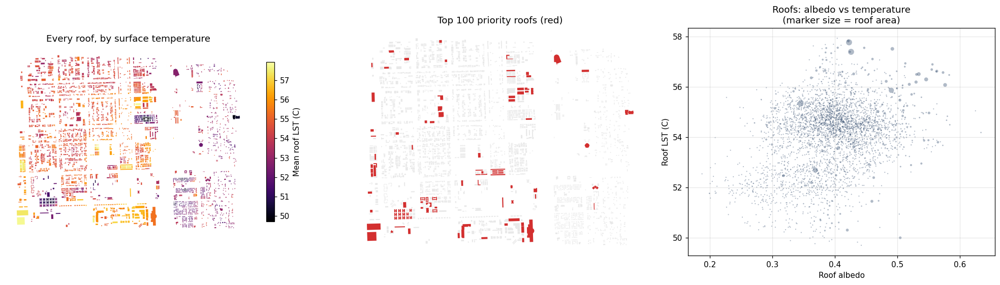
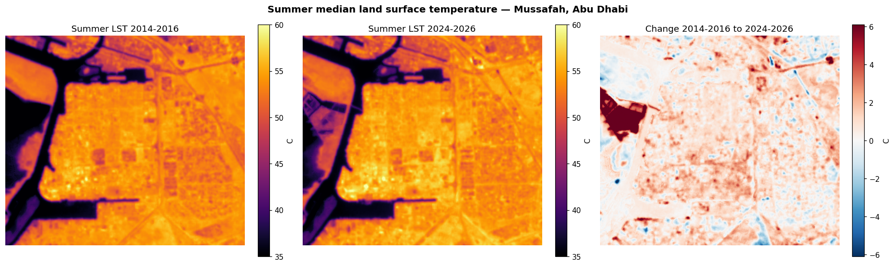
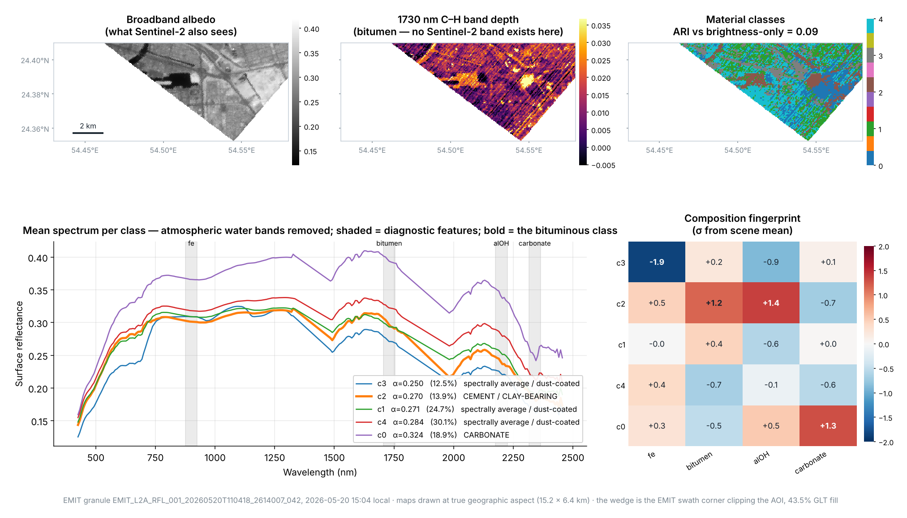

# Cool Roof Priority Index — Mussafah, Abu Dhabi

**Arab Youth Space Hackathon 2026 · 813 Challenge**
**Theme:** Urban Expansion, Land Use Change & Heat Risk  ·  **Track:** Hyperspectral Data Track
**Team:** T0050 · United Arab Emirates

> Satellite screening that turns a city heat map into a ranked worklist of individual
> rooftops — with the cooling-per-retrofit **measured from Abu Dhabi's own data**, and
> the roof material identified from **NASA EMIT hyperspectral imagery over Mussafah
> itself**.



---

## 2 · The business use case

### 2.1 Who the user is, and the decision they make

The asset-management and urban-planning departments of a Gulf municipality — Abu Dhabi
City Municipality in our case. Each budget cycle they allocate a finite heat-mitigation
budget across thousands of candidate buildings. Cool-roof coating is among the cheapest
interventions available, but it has to be targeted: coating every roof in an industrial
district is not affordable, and coating the wrong ones wastes the budget.

**What they use today.** City-scale urban heat island maps from consultants or research
groups, plus manual site survey. Those maps show *where it is hot*. They do not say
*which roof to treat first*, *how much cooling the treatment buys*, or *whether that
roof can be coated at all*. The step from map to works programme is taken on judgement.

### 2.2 Why ownership makes this harder than it looks

Roof ownership in Mussafah is split three ways, and the municipality has a **different
lever for each**:

| Who owns the roof | Municipality's lever | What the ranking is used for |
|---|---|---|
| **ADM-owned municipal buildings** | Direct capital works | Sequencing its own retrofit programme against budget |
| **Other government entities** | Inter-entity coordination; each holds its own capex | Showing an entity its own stock, ranked, with the evidence |
| **Private industrial landlords** (most of Mussafah's roof area) | Regulation, permit conditions, incentive schemes — **not** direct spending | Targeting where a code change or incentive buys the most cooling per unit of regulatory effort |

This is the reason a ranked list has value even where the municipality is not paying.
For privately owned stock the output is not a works order, it is **an evidence base for
where to apply a rule**. A blanket requirement across an industrial district is
politically expensive; a requirement aimed at the 2.8% of roofs carrying 21% of the
available cooling is defensible.

### 2.3 Commercial model

Procurement reality in Abu Dhabi favours a **periodic study, not a software
subscription**. Municipal departments buy consultancy studies on a multi-year cycle far
more readily than they take on recurring software. The natural cadence is **once every
three to four years**, which also matches how fast the building stock and its surfaces
actually change.

So the product is a **repeat screening study**:

- **Deliverable:** ranked roof inventory (CSV + GIS layer), heat and material maps, and
  a prioritisation report, scoped to a district or to a single entity's portfolio
- **Cadence:** every 3–4 years, with the previous run as the baseline, so the second
  study also measures what the first one achieved
- **Cost base:** the input data is free and open (Landsat, Sentinel-2, EMIT,
  OpenStreetMap). Essentially all cost is analyst time, which is why this is viable at
  district scale where a field survey of 3,603 roofs never would be.
- **Buyers:** ADM for its own stock; other government entities for theirs; large
  industrial landlords and free-zone operators for their portfolios.

**On unit rates — deliberately left open.** The pipeline outputs cooling per square
metre and avoided solar absorption in kilowatts. It does **not** embed a coating price.
ADM already maintains its own schedule of rates, and so does every contractor who would
bid the works. The ranking becomes a cost-effectiveness ranking the moment the client's
own rate card is applied to the `area_m2` column — one multiplication. Publishing an
invented AED/m² figure would add nothing and would be the first number a procurement
reviewer challenged. The ranking is deliberately rate-agnostic, so it works against
whichever schedule of rates the client already holds.

---

## 3 · The problem

Gulf cities are among the fastest-warming urban environments on Earth, and the warming
is not only climatic — it is constructed. When bare desert is replaced by asphalt,
concrete and dark roofing, surface albedo falls, shortwave absorption rises,
evapotranspirative cooling disappears, and stored heat is re-radiated through the night.

In Mussafah, Abu Dhabi's principal industrial district, a decade of Landsat observation
shows:

- **30.2 km² (3,023 hectares) of bare desert converted to built-up land** between
  2014–2016 and 2024–2026
- built-up surfaces today run **+2.35 °C hotter** than surrounding bare desert
  (53.82 °C against 51.48 °C in the summer composite)
- **the existing built fabric is warming 0.23 °C per decade faster than the desert
  around it** (t = 47.0, p < 10⁻³⁰⁰, Cohen's d = 0.24)

The third point is what makes retrofit, rather than new-build regulation, the right
lever: **the heat problem is intensifying inside the city that already exists**, not at
the expansion frontier (see §9.3).

**Why satellite data is the right instrument.** Rooftop albedo, surface temperature and
material cannot be inventoried at city scale by any ground method at acceptable cost —
tens of thousands of roofs, most behind private fences. Earth observation measures all
three for every roof simultaneously, repeatedly, without site access.

---

## 4 · Data used

| Product | Provider | Level | Dates | Scenes | Resolution | Licence |
|---|---|---|---|---|---|---|
| Landsat 8/9 Collection 2 Level-2 | USGS / NASA | L2SP | 2014-05-18 → 2016-09-28 | 40, cloud < 15%, **May–Sept only** | 30 m | Public domain |
| Landsat 8/9 Collection 2 Level-2 | USGS / NASA | L2SP | 2024-05-29 → 2026-09-24 | 40, cloud < 15%, **May–Sept only** | 30 m | Public domain |
| Sentinel-2 L2A | ESA Copernicus | L2A | 2022-09-13 → 2026-09-27 | 20, cloud < 15%, **May–Sept only** (five summers) | 10–20 m | Free and open |
| **NASA EMIT L2A surface reflectance** | **NASA JPL / LP DAAC** | **L2A** | **2026-05-20, 15:03 local** | **1 granule** | **60 m, 285 bands** | **Open** |
| ESA WorldCover v200 | ESA | — | 2021 | tile N24E054 | 10 m | CC BY 4.0 |
| OpenStreetMap buildings | OSM contributors | — | 2026-10-07 | 8,503 raw | vector | ODbL |

Scene IDs, query windows and cloud thresholds are written to
`data/sample_input/provenance.json` on each run. Access is via the **Microsoft
Planetary Computer STAC API**, **NASA Earthdata (CMR + LP DAAC)** for EMIT, and the
**Overpass API** for OpenStreetMap.

### 4.1 How we arrived at EMIT, and what we checked first

Satellite 813 data is not available to participants during the PoC phase. We therefore
searched for open hyperspectral coverage of the AOI, and record the search because the
negative results are part of the evidence:

- **Planet Tanager** — we walked the open STAC catalogue. **No `urban` scene intersects
  the UAE in the open archive.** Tanager-1 has daily revisit, so the satellite has
  certainly imaged Abu Dhabi; the *open archive* is a curated public sample and that is
  what we searched. We briefly prepared a declared Riyadh analogue (24.58 °N, the same
  latitude and climate) and then discarded it once real coverage was found.
- **NASA EMIT** — **47 L2A granules intersect Mussafah.** EMIT is an imaging
  spectrometer on the ISS whose mission is arid-region surface mineralogy, which is why
  the Arabian Peninsula is well covered. We selected on summer timing, sun angle, AOI
  overlap and recency.

We report this because "no hyperspectral coverage exists" would have been wrong, and
checking only the first archive we were handed would have produced that wrong answer.

---

## 5 · Technical approach

**1 — Surface temperature.** Landsat Collection 2 **Level-2**, which ships a
USGS-produced atmospherically corrected Surface Temperature band (band 10, ASTER GED
emissivity). We deliberately do not derive LST from top-of-atmosphere radiance: Level-2
removes a class of hand-made assumptions and gives a citable processing chain. Scaling
`K = DN × 0.00341802 + 149.0`; per-pixel cloud, cirrus, shadow and dilated-cloud masking
from `qa_pixel` before compositing; per-pixel median over each epoch window.

**2 — One sensor for both epochs.** Both the thermal and the optical layers of the
change analysis come from Landsat. Mixing Landsat 2014 with Sentinel-2 2025 would fold a
cross-sensor calibration difference into what we report as real-world change. Sentinel-2
is used only for present-day albedo, where no cross-epoch comparison is made.

**3 — Built-up classification: a documented escalation.** We began with the standard
index threshold (`NDBI > 0`) as the simple explainable baseline. **It failed**, and we
established that rigorously: calibrating the threshold to maximise F1 on a spatially
held-out half left precision pinned at **0.40 at every threshold tested**, with 92% of
the AOI labelled built-up against a 41% reference. The reason is physical —
NDBI = (SWIR − NIR)/(SWIR + NIR), and **bare sabkha is SWIR-bright exactly like
concrete**. With that failure documented we escalated to a **random forest on 14
features including multi-scale texture** (local standard deviation at ~150 m and ~270 m):
industrial fabric is spatially rough at 30 m, sabkha is smooth. The same model is
applied to both epochs.

**4 — Broadband albedo.** Sentinel-2 narrow bands via published narrow-to-broadband
coefficients:

```
α = 0.2266·B2 + 0.1236·B3 + 0.1573·B4 + 0.3417·B8 + 0.1170·B11 + 0.0338·B12
```

(weights sum to 1.0, so the conversion carries no additive constant). **Source:**
Bonafoni, S. & Şekertekin, A. (2020), *Albedo Retrieval From Sentinel-2 by New
Narrow-to-Broadband Conversion Coefficients*, IEEE Geoscience and Remote Sensing Letters
**17**(9), 1618–1622, [doi:10.1109/LGRS.2020.2967085](https://doi.org/10.1109/LGRS.2020.2967085).

The six weights were checked against an independent implementation —
[GRASS GIS `i.albedo`](https://github.com/OSGeo/grass/pull/7935), which cites the same
paper — and match to four decimal places on every band.

**5 — Calibrating the intervention (the analytical core).** Over pixels that *both* our
classifier and ESA WorldCover independently call built-up, with water and vegetation
excluded, we regress epoch-B LST on albedo controlling for NDVI. The slope is the
**locally measured marginal effect of albedo on surface temperature**. Uncertainty comes
from a **300-sample spatial block bootstrap** — resampling whole 1 km blocks, not
pixels, because pixel resampling ignores spatial autocorrelation and understates the
interval.

**6 — Hyperspectral material identification (EMIT).** EMIT ships in sensor geometry
with a geometric lookup table; we orthorectify only the AOI window. Atmospheric water
bands (1340–1480, 1790–1980 nm) and the detector edges are removed — EMIT's own
`good_wavelengths` flag retains them and reflectance there is noise — leaving **230
bands, 425–2455 nm**.

Clustering the raw spectra does not work, and we report why: the six classes came back
with near-identical shapes differing only in brightness, because **in a dust-blown arid
city sand, concrete and dusty roofs share a carbonate/silicate spectral shape**. We
therefore measure **band depth against a local two-point continuum** (Clark & Roush,
1984) at four diagnostic features, then cluster on the standardised depths:

| Centre | Feature | Diagnostic of |
|---|---|---|
| 900 nm | Fe-oxide | rust, red tile, ferruginous sand |
| **1730 nm** | **C–H stretch** | **bitumen / asphalt — invisible to Sentinel-2** |
| 2200 nm | Al–OH | clay, cement, concrete |
| 2340 nm | carbonate | limestone aggregate, sabkha sand |

Classes are interpreted by **deviation from the scene mean**, not absolute depth,
because carbonate absorption dominates everywhere in a carbonate-sabkha setting.

**7 — Roof-level ranking.** OSM footprints; zonal mean albedo and LST per roof;

```
ΔT      = |sensitivity| × max(0, 0.60 − current_albedo)      with CI bounds
benefit = ΔT × roof_area_m²                                   [°C·m²]
ΔQ      = (0.60 − current_albedo) × S × area                  [W avoided]
```

**S, the irradiance constant, is anchored to measured Abu Dhabi data.** Islam et al.
(2009) report a full year of ground pyranometer records at 24.43 °N, 54.45 °E:

| Quantity, measured | Value |
|---|---|
| Highest **monthly** mean global solar radiation | **290 W/m²** |
| Highest **daily** mean | 369 W/m² |
| Highest one-minute average | 1,041 W/m² |
| Yearly mean | 18.48 MJ/m²/day = **214 W/m²** over 24 h |

We use **S = 300 W/m²**, a round working value **3.4% above the measured 290 W/m²
monthly mean**, and **S_NOON_PEAK = 950 W/m²**, below the measured 1,041 W/m²
one-minute maximum. The 3.4% is stated rather than buried: at the measured 290 the
top-100 figure would be **54.6 MW** instead of 56.5 MW.

Two things follow that matter more than the rounding. These are **24-hour** means, not
daytime means, so ΔQ is avoided absorption averaged over the whole diurnal cycle — the
conservative reading, not the flattering one. And **ΔQ scales linearly in S**, so any
reader preferring a different irradiance basis rescales the megawatt figures by one
multiplication; the notebook prints the 290 W/m² equivalent on every run.

Area enters deliberately: one large warehouse roof is far cheaper to treat per square
metre than fifty small ones. Three ranking modes are produced (§9.5).

**Validation is spatial throughout, never random pixel splits** — neighbouring pixels
are near-duplicates and a random split leaks them across the train/test boundary.

---

## 6 · Installation

Requires **Python 3.11**.

```bash
git clone https://github.com/RISKYXBT/coolroof-mussafah.git
cd coolroof-mussafah
python -m venv .venv && source .venv/bin/activate
pip install -r requirements.txt
```

The main analysis needs no credentials. The EMIT notebook requires a **free NASA
Earthdata account** (https://urs.earthdata.nasa.gov/users/new) — registration is instant
and the data is open.

---

## 7 · How to run

```bash
jupyter lab notebooks/02_main_analysis.ipynb     # ~30-40 min, no GPU
jupyter lab notebooks/04_emit_hyperspectral.ipynb # ~15 min, needs Earthdata login
```

Run all cells top to bottom. Nothing needs editing to reproduce our result. To run a
different city, change only `AOI_BBOX`, `FOCUS_BBOX` and the epoch windows in the
configuration cell.

Optional: `notebooks/00_recon.ipynb` is a 10-minute data-availability check that
downloads no imagery. `notebooks/03_hyperspectral.ipynb` documents the Tanager
catalogue search described in §4.1.

---

## 8 · Example input and output

**Input** — `data/sample_input/albedo_focus.tif` (clipped albedo raster) and
`provenance.json` (every scene ID and parameter used). Full scenes are not committed;
they are openly retrievable with the recorded parameters.

**Output** — `results/`:

| File | Contents |
|---|---|
| `roof_priority_ranked.csv` | all 3,603 roofs: albedo, LST, area, ΔT with bounds, avoided kW, three ranking modes |
| `top500_roofs.geojson` | top 500 roofs as GIS-ready polygons |
| `emit_material_classes.csv/.tif` | EMIT material classes and their composition fingerprints |
| `emit_depth_bitumen_1730.tif` | the C–H band-depth map |
| `transition_summary.csv` | LST change by land-use transition |
| `significance_tests.csv` | Welch tests and effect sizes for every claim |
| `summary.json`, `emit_final_summary.json` | all headline figures and validation statistics |
| `01`–`10_*.png` | figures |




---

## 9 · Results and limitations

### 9.1 Headline results

| Quantity | Value |
|---|---|
| Mean summer LST, 2014–2016 → 2024–2026 | 49.89 °C → 50.89 °C |
| Desert converted to built-up | **30.2 km² (3,023 ha)** |
| Static surface UHI (built-up vs desert, today) | **+2.35 °C** (53.82 vs 51.48 °C, `transition_summary.csv`) |
| Existing built fabric warming vs desert | **+0.23 °C/decade** (t = 47.0, d = 0.24) |
| **Measured albedo sensitivity** | **−5.86 °C per unit albedo**, 95% CI **[−7.54, −4.35]** |
| → cooling per +0.10 albedo | **0.59 °C** [0.44, 0.75] |
| Roofs ranked | 3,603 (4.82 km² of roof) |
| Top 100 roofs | 20.9% of total benefit — **7.5× concentration** |
| Avoided solar absorption, top 100 | **56.5 MW** summer-mean, 179 MW at noon peak |

### 9.2 Validation

**Built-up classification** — 2 km spatial blocks, 60/40 split, metrics on held-out
blocks only (n = 95,346 test pixels):

| Metric | NDBI > 0 baseline | Random forest |
|---|---|---|
| accuracy | 0.458 | **0.768** |
| precision | 0.422 | **0.673** |
| recall | 0.844 | **0.854** |
| F1 | 0.563 | **0.753** |
| IoU | 0.392 | **0.604** |
| false positives | 45,533 | **16,345** |
| predicted built-up share | 82.9% | 52.4% *(reference 41.3%)* |

Top features: `swir` 0.133, `mndwi` 0.127, **`tex_bright_5` 0.109**, **`tex_swir_5` 0.072**,
**`tex_swir_9` 0.070**, `brightness` 0.069, `red` 0.063. The three texture features
account for roughly a quarter of the model's decision weight — direct evidence for why
the spectral index alone failed.

**Albedo → LST model** — 5-fold spatial block CV, 1 km blocks:

| | |
|---|---|
| slope | −5.86 °C per unit albedo |
| 95% CI (300 block bootstrap resamples) | **[−7.54, −4.35]** |
| spatial-CV R² | 0.130 |
| spatial-CV RMSE | 1.70 °C |
| n | 175,033 px in 188 blocks |

**On the low R².** The model explains 13% of the variance in absolute LST, and we report
that plainly. It does not undermine the result, because **we estimate a marginal effect,
not a prediction**. Absolute surface temperature over built land is driven mostly by
factors we do not model — thermal mass, moisture, building use, HVAC exhaust. The
coefficient on albedo is nonetheless tightly constrained: its entire 95% interval lies
below zero and it is stable across independent spatial folds.

**A sign error we caught and fixed.** A loose mask (`NDBI > 0` alone) gives a slope of
**+20.49** — brighter surfaces appearing hotter, inverting the physics. The cause is
contamination: channel water (dark *and* cold) anchoring the low-albedo end, bright
sabkha (bright *and* very hot) anchoring the high end. Requiring agreement with an
independent land-cover product recovers the expected negative slope. The notebook
computes **both** masks on every run and `summary.json` keeps both values, because the
audit trail is part of the evidence.

**What the season filter changed.** An earlier version of this analysis selected scenes
by lowest cloud over a continuous date range, with no month filter. That produced
composites which were 88%, 72% and 20% May–Sept respectively, and regressed a
warm-season temperature composite on a **cool-season** albedo composite — Gulf summer
dust and haze trip the Sentinel-2 cloud mask, so "cleanest" quietly meant "winter".
Restricting every composite to May–September, over a Sentinel-2 window widened to five
summers so enough clean scenes exist:

| | unfiltered | May–Sept only |
|---|---|---|
| albedo sensitivity | −4.56 | **−5.86** |
| 95% CI | [−6.05, −2.94] | **[−7.54, −4.35]** |
| spatial-CV R² | 0.057 | **0.130** |
| pixels / blocks | 152,487 / 159 | 175,033 / 188 |
| static UHI | +1.33 °C | **+2.35 °C** |

Matching the seasons **more than doubled the explained variance** and strengthened the
effect. The season composition of every composite is written into `summary.json` under
`season_filter` and into `provenance.json`, so it can be checked without recomputing
from scene IDs.

### 9.3 Conversion buys no extra warming — a significant result that means nothing

**Land converted from desert to built-up did not warm more than desert left untouched.**
The contrast is **−0.028 °C** (t = −4.0, p = 6.6 × 10⁻⁵, **Cohen's d = −0.025**).

It is flagged SIGNIFICANT, and that label should be ignored. With n in the hundreds of
thousands, a p-value detects any departure from exactly zero; **d = −0.025 is a
twenty-fifth of a standard deviation**, which is nothing. Converted land is not
measurably warmer than desert, and if anything it is a hair cooler. We report the
effect size alongside every p-value in `significance_tests.csv` for exactly this
reason.

The diagnostic explains why. In 2014–2016, *before any construction*, land that would
later be built on was already **2.48 °C hotter** than desert that stayed desert
(53.23 °C vs 50.74 °C) while being spectrally almost indistinguishable from it. The
pre-existing gap is an order of magnitude larger than the conversion effect, which is
why conversion adds nothing detectable on top of it.

Two explanations fit and **we cannot separate them**:

1. **Siting.** Development occurs adjacent to existing urban fabric, so the land was
   already inside the city's thermal footprint. A spatial confound.
2. **Site preparation.** Clearing and compaction remove the salt crust and shallow
   moisture of natural sabkha, raising surface temperature before any structure exists.

Distinguishing them needs construction-timing records or a matched-control design
pairing converted parcels with equidistant unconverted ones. Out of scope here, and the
natural next step.

### 9.4 The roof cross-section does not confirm the per-roof predictions

We ranked the roofs, then tested the ranking against itself. Across the 3,603 buildings,
**a brighter roof is not a cooler roof**: the cross-sectional association is
**+6.59 °C per unit albedo** (p ≈ 10⁻⁷⁵, r² = 0.089), and it survives controlling for
roof size (+4.82). That is the opposite sign to the −5.86 the product is built on, and it
is visible in panel 3 of `results/05_roof_priority.png` — a file we ship. Reporting it is
not optional.

**Part of it is the thermal pixel.** Landsat thermal is 30 m, so one pixel is 900 m². The
median roof in the ranking is 795 m² — under one pixel — and its "roof temperature" is
therefore largely its surroundings. Splitting by roof size:

| Roof size | median area | ≈ Landsat px | slope | p |
|---|---|---|---|---|
| Q1 | 438 m² | 0.5 | **+7.74** | 10⁻²¹ |
| Q2 | 573 m² | 0.6 | +4.14 | 10⁻⁷ |
| Q3 | 795 m² | 0.9 | +2.29 | 10⁻⁴ |
| Q4 | 1,185 m² | 1.3 | +2.39 | 0.003 |
| Q5 | 2,399 m² | 2.7 | +4.62 | 10⁻⁷ |
| ≥ 5,000 m² (n = 93) | — | ~5.5 | +2.88 | **0.23, not significant** |

The association is strongest where the pixel is dirtiest and is not significant for the
93 roofs that span a clean pixel — but it does not flip negative, so mixing is not the
whole story.

**The rest is a between-building confound.** Brighter-roofed buildings in Mussafah are
systematically different buildings: larger, newer, set in wider paved yards, with
different roof thermal mass and internal heat loads. None of those are in our data, and
none of them are removed by comparing across buildings.

**Why this does not refute −5.86.** The two numbers answer different questions. The
pixel-level model asks *does a brighter surface run cooler, holding location and
vegetation roughly fixed* — a within-block marginal effect, and the answer is yes. The
roof cross-section asks *are buildings that happen to have brighter roofs cooler
buildings* — a between-unit comparison, and the answer is no. The second is a fact about
which buildings in Mussafah have bright roofs; it is not a statement about radiative
physics, and it is exactly the kind of comparison the spatial-block design was chosen to
avoid.

**What it costs us, stated plainly.** The per-roof `delta_T_est_c` column is a screening
estimate carried down from a pixel-level marginal effect. **It is not validated at
individual-roof scale, and our own data does not confirm it.** Settling it requires a
before/after measurement on coated roofs, or a matched-pair design holding building type,
size and surroundings fixed. That is step 1 of the proposed next phase, and until it is
done the ΔT column should be read as a prioritisation score, not as a predicted
temperature drop for a named building.

---

### 9.5 Three ranking modes — a policy choice, not a technical one

| Mode | Top-100 area | Mean albedo | Mean LST | Avoided absorption |
|---|---|---|---|---|
| Total benefit (area × cooling) | 99.4 ha | 0.395 | 54.5 °C | 56.5 MW |
| Hottest roofs first | 48.1 ha | 0.426 | 56.8 °C | 22.3 MW |
| Biggest per-roof ΔT | 5.0 ha | 0.245 | 52.3 °C | 5.4 MW |

Only **21 of 100 roofs** appear on both the "total benefit" and "hottest" lists. The
choice of objective genuinely changes which buildings get treated, so it belongs to the
municipality. All three ship in the CSV.

### 9.6 What hyperspectral adds, and what it does not

EMIT granule `EMIT_L2A_RFL_001_20260520T110418_2614007_042`, 2026-05-20 at 15:03 local
— **three hours later in the day than Landsat's ~10:30 overpass**, so it samples closer
to peak surface temperature. 12,738 clean spectra, 230 bands.

**Two classes carry real compositional signal** (σ from scene mean):

| Class | Share | Albedo | Fe | **Bitumen** | **Al–OH** | Carbonate | Reading |
|---|---|---|---|---|---|---|---|
| **2** | 13.9% | 0.270 (sd **0.082**) | +0.5 | **+1.2** | **+1.4** | −0.7 | bituminous + cement-bearing built surface |
| **0** | 18.9% | 0.324 | +0.3 | −0.5 | +0.5 | **+1.3** | carbonate — bare sabkha sand |
| 3 | 12.5% | 0.250 | **−1.9** | +0.2 | −0.9 | +0.1 | iron-depleted; possibly shadowed |
| 1 | 24.7% | 0.271 | 0.0 | +0.4 | −0.6 | 0.0 | spectrally average |
| 4 | 30.1% | 0.284 | +0.4 | −0.7 | −0.1 | −0.6 | spectrally average |

**Adjusted Rand Index against clustering on albedo alone: 0.092.** The composition
grouping is almost independent of brightness — the absorption features are separating
surfaces that broadband albedo cannot.

**The claim, stated precisely.** Class 2 is not the darkest class (class 3 is, at
0.250), but it is the one enriched in both the 1730 nm C–H bitumen feature and the
2200 nm Al–OH cement feature while being depleted in the carbonate background, and it
has the widest albedo spread of any class (0.082 against ~0.03), consistent with mixed
built materials rather than uniform sand. Broadband albedo identifies these surfaces as
dark; the narrow bands identify them as bituminous and cement-bearing — which is what
determines whether a roof can be coated or has to be replaced.

A visual check: the darkest patch in the albedo map (α ≈ 0.13) coincides with the
strongest 1730 nm response in the scene, consistent with a large asphalt or bitumen
surface. Mussafah contains asphalt plants.

**What hyperspectral does not do here.** Three of five classes — **67% of the imaged
area** — are spectrally average, with no feature more than 0.7σ from the scene mean.
Aeolian dust deposition homogenises surface spectra in an arid industrial zone, so
hyperspectral meaningfully differentiates roughly **one third** of the scene, not all of
it. We consider this worth reporting for its own sake: any operational hyperspectral
urban product over Gulf cities, including Satellite 813, will face the same constraint.

### 9.7 Limitations

- **The albedo composite is September-weighted within the summer.** Every composite is
  now May–Sept only, but of the 20 Sentinel-2 scenes **17 fall in September**, two in
  June and one in July: the cloud mask still prefers the end of the dust season. Abu
  Dhabi in September is hot, so this is a far smaller mismatch than the cool-season
  composite it replaced, but albedo and temperature are still not sampled identically
  within the season.
- **The albedo composite spans five summers (2022–2026)** while the temperature
  composite spans three (2024–2026). A roof re-covered in 2023 contributes its old
  surface to the albedo median. Narrowing the albedo window needs either a higher cloud
  threshold or acceptance of fewer scenes.
- **The per-roof ΔT is not validated at roof scale.** See §9.4 — the roof cross-section
  shows the opposite sign, for reasons we can partly but not fully attribute to mixed
  thermal pixels. Treat the ΔT column as a prioritisation score.
- **Land surface temperature is not air temperature.** Satellites measure the radiating
  skin of the surface. Human thermal comfort depends on air temperature, humidity and
  radiant load. This tool ranks *surfaces*; it does not predict heat-stroke risk.
- **The sensitivity is correlational, not causal.** §5 step 5 measures covariance across
  space. It is not a controlled experiment, and confounders — roof thermal mass,
  building use, HVAC exhaust, roof age — are not separated. The ΔT figures are screening
  estimates with stated bounds, not engineering predictions.
- **Validation is against a model, not ground truth.** ESA WorldCover is itself a
  classification product. No field survey or in-situ logging was performed.
- **The classifier still over-predicts built-up** (52.4% vs 41.3% reference). Precision
  0.673 means roughly a third of pixels we call built-up are not; the land-cover areas in
  §9.1 carry that bias.
- **The 2021-trained classifier is applied to 2014–2016 imagery**, assuming spectral
  stationarity for the same sensor. Reasonable, unverified.
- **EMIT spatial resolution.** 60 m, one pixel 3,600 m². Material classes are reliable
  only for roofs spanning a clean pixel; the top-100 roofs average 1.07 ha (~3 pixels),
  smaller roofs in the ranking are spectrally mixed.
- **EMIT coverage is partial.** The granule's southern edge falls at 24.353 °N against an
  AOI south edge of 24.29 °N, with 43.5% geometric-lookup fill — roughly **46 km² of the
  195 km² AOI**, the northern strip. The material results describe that strip.
- **Detector striping.** Both the 2200 nm and the 1730 nm band-depth maps show diagonal
  striping, so part of those signals is instrumental rather than surface. The coherent
  patches in the 1730 nm map are not stripe-aligned and we read those as real, but the
  per-pixel depths should not be over-interpreted.
- **Spectral inference only.** Classes are "consistent with" a material, never confirmed
  as one. No field verification was carried out.
- **Mixed thermal pixels.** Landsat thermal is 30 m; roofs below ~900 m² carry signal
  from surroundings. Roofs under 400 m² are excluded.
- **OSM completeness varies.** Missing footprints are missing from the ranking. A
  deployed version would use municipal cadastral data.
- **Overpass time.** Landsat crosses at ~10:30 local; peak surface temperature is later,
  so absolute values understate the daily maximum. Relative ranking is unaffected.
- **Avoided absorption is not avoided energy.** The megawatt figures are reduced
  shortwave absorption at S = 300 W/m², a round value 3.4% above the 290 W/m² highest
  monthly mean measured in Abu Dhabi (Islam et al. 2009), averaged over the full
  24-hour cycle; at the measured 290 the figure is 54.6 MW. They are **not** an
  air-conditioning energy saving: what a cooler roof does to a building's cooling load
  depends on roof insulation, HVAC efficiency and occupancy, none of which are in this
  analysis.

---

## 10 · Team, licence and attribution

| Member | Role |
|---|---|
| Meera Almansoori | Team lead · surface energy balance physics, methodology, validation design |
| Ghazi Hafedh | Data pipeline, modelling, software, repository |
| Ahmed Abu Farha | Municipal building-control domain input, end-user requirements |

**Code licence:** MIT (see `LICENSE`).

**Data attribution.**
Landsat Collection 2 Level-2 courtesy of the U.S. Geological Survey.
Contains modified Copernicus Sentinel-2 data (2022–2026).
EMIT data courtesy of NASA JPL, distributed by the LP DAAC.
© ESA WorldCover project 2021, CC BY 4.0.
Map data © OpenStreetMap contributors, Open Database Licence.

**Methods cited.**
Bonafoni, S. & Şekertekin, A. (2020). *Albedo Retrieval From Sentinel-2 by New
Narrow-to-Broadband Conversion Coefficients.* IEEE Geoscience and Remote Sensing
Letters, 17(9), 1618–1622. doi:10.1109/LGRS.2020.2967085

Islam, M. D., Kubo, I., Ohadi, M. & Alili, A. A. (2009). *Measurement of solar energy
radiation in Abu Dhabi, UAE.* Applied Energy, 86(4), 511–515.
doi:10.1016/j.apenergy.2008.07.012
Clark, R. N. & Roush, T. L. (1984). *Reflectance spectroscopy: quantitative analysis
techniques for remote sensing applications.* JGR Solid Earth.
USGS (2024). *Landsat Collection 2 Level-2 Science Product Guide.*

**Built on.** Starter notebooks and data-access patterns from the official
[813 Challenge repository](https://github.com/Tnecniv-Teikram/813-hyperspectral-hackathon)
by Dr. Vincent Markiet, Space42.

No credentials, API keys or restricted imagery are committed to this repository.
